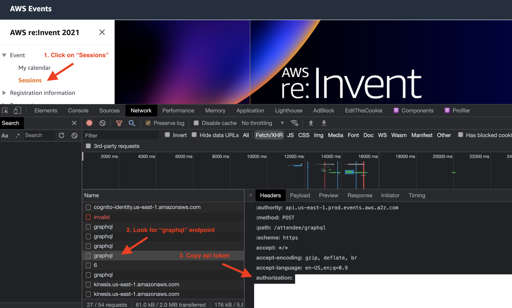

# Background

Find available AWS re:Invent 2021 sessions that you could still reserve.

# Usage

## Obtain Api Token
1. Login into: https://portal.awsevents.com/events/reInvent2021/dashboard/event/
2. Obtain your personal api token in developer tools:

## Setup
    nvm use
    npm install
    
    export AWS_REINVENT_API_TOKEN=<<YOUR_AWS_REINVENT_API_TOKEN>>

## Execute Script
    sh run.sh

## How to read `results.txt`
Output format:

    ##### [Available Status] Start Time - End Time, Venue, [Session Code] Session Title
        Conflict reserved: **Conflict Reserved Session Title**
        Conflict waitlisted: **Conflict Waitlisted Session Title**
        !!!!! No conflict !!!!!

### Example
Available to reserve session with a conflict:

    ##### [RESERVABLE] 12/2/2021, 4:00:00 PM - 12/2/2021, 5:00:00 PM, Caesars Forum, [STG330] Get the best of both worlds with hybrid cloud storage
        Conflict reserved: "Hands-on Amazon EKS SaaS: Building a multi-tenant SaaS solution on AWS [REPEAT]"

Available to reserve session without a conflict:

    ##### [RESERVABLE] 12/3/2021, 8:30:00 AM - 12/3/2021, 9:30:00 AM, Caesars Forum, [STP206] Drift on AWS: Transforming how businesses buy from businesses
        !!!!! No conflict !!!!!